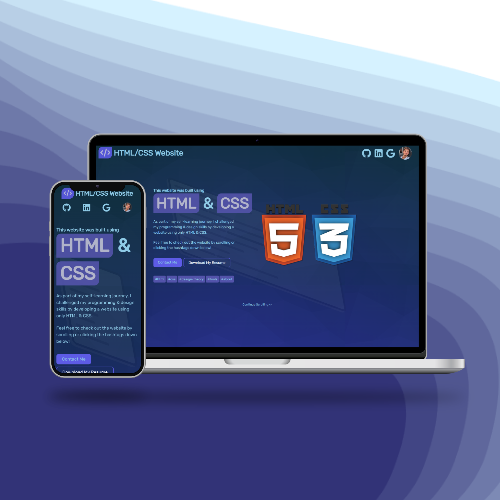

# HTML & CSS Project
As part of my self-learning journey, I challenged my programming & design skills by developing a website using only HTML & CSS.

I created this project using some of the knowledge I gained in:
- HTML, CSS
- Graphic Design
- Git & Github

Thank you for your time 😁

Live site: https://gateniomer.github.io/HTML-CSS-Project/

Github repo: https://github.com/gateniomer/HTML-CSS-Project

